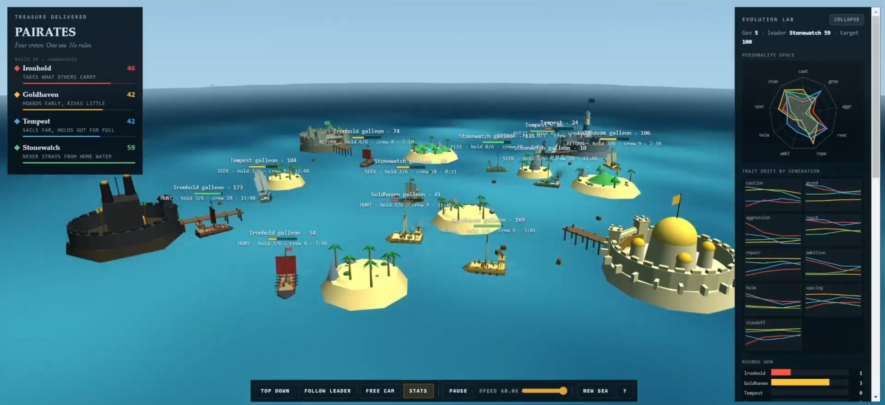

# pAIrates

Four AI pirate crews fighting over treasure in a shared sea. They all run the exact same brain. The only thing separating them is nine numbers, and those numbers change between rounds depending on who won.

**[Run it here](https://pairates.vercel.app/)**, no install, no signup, it's one HTML file.

*30 second demo, or [watch on YouTube](https://youtu.be/9MaCU-6WmJA)*

## Why I built this

I've always loved watching videos from people like Primer and b2studios, where they simulate a population of little AI agents over hundreds of generations and show how one tiny change to a behavior completely reshapes who survives and who dies out. There's something great about watching a system you didn't fully design produce a result you didn't expect. I wanted to build something like that for myself, partly as a fun side project and partly to actually get hands on with evolution over generations, which I think is a genuinely fascinating corner of this space (technically it isn't "AI" the way people usually mean it, but you know what I mean).

I also wanted my own spin on it. The main thing I cared about was making the environment and conditions easy to mess with, not just for me but for anyone else who wants to try. Almost every variable is on a dial. You can change a faction's personality mid run, crank the mutation rate, make treasure scarce, change how hard they chase the big prize, speed the whole thing up, and watch how different the next handful of generations turn out.

The other half of it is that I just love the small details. Crews walking around the deck, ships getting upgraded once they've got enough hands, porters hauling chests down the pier one at a time. None of that actually matters to the data coming out the other end, but it makes it feel like a living thing I'm watching instead of a spreadsheet, which I think is really cool. And I love pirates, so that's the theme.

It's not as polished as I'd like. It did what I wanted it to do though, and I hope someone else out there finds it interesting too. If you're into this kind of thing it's a decent sandbox to poke at, with a reasonably nice way to visualize what's happening alongside it. Hope you enjoy it.

## How it works

Every crew calls the same `think()` function. Ironhold doesn't have special raider code and Goldhaven doesn't have special hoarder code. They just have different values for the same nine parameters, and the personalities fall out of that.

A round ends when someone banks 100 chests. That's the only feedback the system gets. The four factions get ranked, the winner's numbers wobble slightly in place, and the losers drift toward the winner plus some random noise. Then the sea regenerates, the strongholds swap corners so map position can't be the reason anyone won, and it runs again.

## Stuff I found running it

Both of these are from single runs and the variance is honestly pretty big, so run it yourself and see if you get the same thing.

**The personalities don't survive.** Diversity, meaning the spread between the four factions across all traits, dropped from 4.26 to 1.54 in six generations. Everyone copies whoever is winning, so they all end up as roughly the same pirate. The four distinct crews you start with are temporary.

**Going for the big prize is a bad idea.** A golden chest surfaces in the middle of the map every 90 seconds and is worth six normal chests. In one 25 minute run, Tempest (ambition 0.92) grabbed it twelve times and Goldhaven (ambition 0.25) grabbed it once. Goldhaven won 92 to 75. Ten ships got sunk while carrying it. The middle of the map is the most dangerous water on the board and carrying the prize basically puts a target on you, since rival crews will cross the whole map to come get you.

I didn't design either of those outcomes. That's just what the numbers did.

## The nine parameters

| | |
|---|---|
| `caution` | how likely she is to run instead of fight |
| `greed` | how full the hold gets before sailing home |
| `aggression` | how much she prefers hunting over gathering |
| `reach` | how far from home she'll sail |
| `repair` | how beat up before she spends 5 seconds in dock for 75 hull |
| `ambition` | how hard she goes for the golden chest |
| `helm` | rudder authority, turns harder but the rudder drags and scrubs speed |
| `spacing` | how much room she gives other ships |
| `standoff` | what range she fights at, 8 to 23 units |

Everything here has a real cost on both sides. Anything where more was just straightforwardly better got hardcoded instead, because a parameter with an obvious best answer teaches you nothing and just adds noise.

## What's actually in the sim

**Broadside combat.** Cannons only fire across the beam, so a ship has to work herself sideways to her target before she can shoot at all. Charging straight at someone means you can never fire. Manning a gun is a job a crewman physically walks over to do. Shots are ballistic and miss roughly half the time, since gun crews eyeball the target's course and accuracy falls off with range.

**Crews that actually do things.** Nothing is instant. Fishing a chest out of the water means a crewman walks to the fishing station and works it for two seconds with a little progress ring over his head. Unloading means porters carrying chests one at a time down the pier and through the gate, and the score only goes up when the treasure physically gets there.

**A shipyard.** Sunk ships don't respawn, they get rebuilt. Scaffolding rises out of the water, workers hammer on a hull frame for ten seconds, then she launches. There are four berths per base shared between docking, building and repairing, so losing two ships genuinely leaves you short on space.

**Galleons.** Come home with six crew and your ship gets rebuilt bigger. Extra deck, sixteen guns across two rows instead of six, double the cargo, 180 hull instead of 100. Sink one and it comes back off the stocks as a regular sloop again.

**A new archipelago every round.** Five different island shapes, and the layout gets flood filled at generation time to make sure nobody is walled into their corner.

## Controls

| | |
|---|---|
| drag, scroll, right drag | orbit, zoom, pan |
| click a ship | inspect her |
| `F` | free camera, WASD to fly, drag to look, Space and Shift for altitude |
| **Stats** | floating hull, orders and crew above every ship |
| **Evolution lab**, top right | the actual experiment |

The lab has a personality radar, drift charts per trait, a win tally, sliders for every faction's parameters so you can override them mid run, mutation and imitation strength, treasure scarcity, and a **Summary** view with everything from the whole run. **Download data** dumps every generation to CSV (winner, duration, all scores, all parameters) if you want to plot it yourself.

## What this is technically called

It's **evolutionary computation**, specifically an evolution strategy: real valued parameter vectors, gaussian mutation, selection by rank. It's not machine learning in the way people usually mean it. There's no gradient, no loss function, nothing being trained.

The more precise term is **competitive coevolution**, because fitness comes from competing against the other populations instead of against a fixed target. That's known as the Red Queen effect, and it's probably why everything converges. The thing you're chasing keeps moving.

## Technical notes

One HTML file, Three.js r128 from a CDN, no build step, no bundler, no backend, no assets. Clone it and double click it.

A few things that look like mistakes but aren't:

* `OrbitControls` doesn't exist in r128, so the camera rig is hand rolled on purpose.
* The wave math is duplicated in JS and in GLSL. The GPU draws the ocean and the CPU needs identical heights so ships float right. If you change one you have to change the other.
* Placement uses measured bounding boxes instead of hardcoded coordinates, so parts sit on each other's actual measured tops instead of floating or clipping.
* There's a win condition, which was originally something I explicitly didn't want. It's there because the reward function needs something to score. It ends a round, nobody ever "wins" as a player.

## Not done

Storms as a regional weather effect. Best of three rounds per generation, which would clean up the drift charts a lot since right now nine traits only get one round of evidence per generation, but it would also triple how long a run takes.
